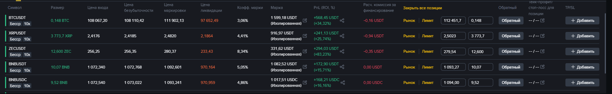
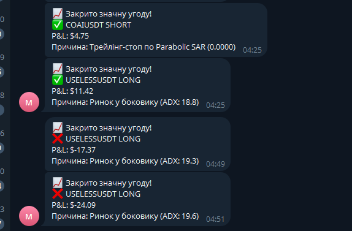

# Binance Futures Strategy Bot

Asynchronous bot for automated futures trading on Binance testnet. Analyzes top USDT pairs, uses 3 strategies (impulse, extreme, trend), fixed $100 risk per trade, 10x leverage, ATR-based position sizing, dynamic TPSL with indicator conditions, Telegram alerts for large PnL, and JSON trade logging.

## Key Features
- **Strategies**:
  - Impulse: VWAP crossover + RSI momentum (short 5-period).
  - Extreme: Bollinger Bands extremes + StochRSI oversold/overbought.
  - Trend: EMA 50/200 crossover + ADX strength (>25).
- **Risk Management**: Fixed $100 risk, ATR multipliers (SL=2.5x, TP=6x R:R).
- **TPSL Logic**: Closes on MACD reversal, low ADX sideways (<20), or hard levels.
- **Real-Time**: Async klines fetch, semaphore for API safety, 60s cycles.
- **Alerts/Logs**: Telegram for >5% PnL; trades.log in JSON (open/close, PnL, reason).

## Architecture Diagram
Strategy Manager --> Top Pairs (24hr Volume) --> Signal Analyzers
|
v
Real Trader (Open Positions) --> TPSL Manager (Monitor Indicators)
|
v
Telegram Alerts + JSON Logs

## Setup & Usage
1. Clone: `git clone`
2. Install: `pip install -r requirements.txt`
3. Configure: `.env` with Binance API/Telegram.
4. Run: `python strategy_manager.py`
   - Analyzes every 60s; check logs for signals.

## Demo

## Limitations & Next Steps
- Testnet only; add live with warnings.
- No backtesting; integrate for optimization.

## Contact
Text-only. [sckrudji@gmail.com]